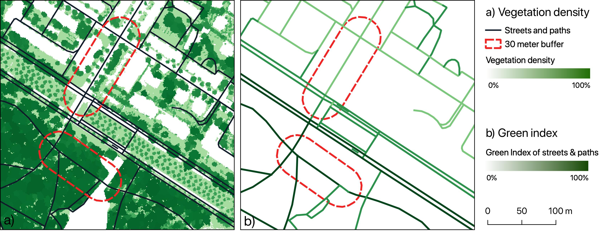

# Green Index Calculation for OpenRouteService

This repository contains the source code to

1. calculate the greenness (i.e. presence of vegetation) based on OpenStreetMap (OSM) and Sentinel-2 data ([Ludwig et al. 2021](https://doi.org/10.3390/ijgi10040251))
2. calculate the green index of each OSM highway feature to be used [openrouteservice](openrouteservice.org) to calculate green routes.

The code is licensed under [BSD 3](./LICENSE.txt) and is part of the study Ludwig, C., Lautenbach, S., Schömann, E., Zipf, A. (2021): *Comparison of fast and green routes for cyclists and pedestrians.* [GIScience Conference 2021](https://www.giscience.org/).

The green index can be calculated for any region, but the quality of the resulting green index depends on the quality of the underlying OSM and Sentinel-2 data.



## Installation

Python 3 and the packages listed in `requirements.txt` are required. You can set up a new python environment with all dependencies using `pip`:

```
$ python3 -m venv env
$ source env/bin/activate
$ python3 -m pip install -r requirements.txt
$ pip install git+git://github.com/reineking/pyds.git
```

## Usage

### 1. Greenness calculation

The first step is to calculate the greenness of individual street blocks within the area of interest using the `calculate_greenness.py` script.

**Example:**

``` console
$ calculate_greenness.py -c config_sample.json -g google_credentials_sample.json
```

**Usage:**

``` console
$ python calculate_greenness.py -h

usage: calculate_greenness.py [-h] --config CONFIG_FILE --google_cred
                              GOOGLE_CRED_FILE

Calculates the greenness based on OSM and Sentinel-2 data.

optional arguments:
  -h, --help            show this help message and exit
  --config CONFIG_FILE, -c CONFIG_FILE
                        Path to configuration file (.json) describing the area of interest (aoi)
  --google_cred GOOGLE_CRED_FILE, -g GOOGLE_CRED_FILE
                        Path to json file containing credentials for using
                        google earth engine
```

##### Configuration file: -c / --config

The configuration file is a json file which contains all parameters required to describe the area of interest, e.g. [./config/config_sample.json](./config/config_sample.json)

``` json
{
  "name": "sample",
  "bbox": [8.46874,49.4971,8.49213,49.50995],
  "epsg": "32632",
  "timestamp": "2021-08-15",
  "cloud_coverage": 5,
  "ndvi_year": 2020,
  "output_dir": "./data"
  "fuzzy_centers": {
    "green": 0.71,
    "mixed": 0.43,
    "grey": 0.15,
    "d": 0.094
  },
}
```

| Parameter | Explanation                                           |
|-----------|-------------------------------------------------------|
| name | The name of the area of interest. Used in output file names. |
| bbox | Bounding box of area of interest in geographic coordinates, format: (minx, miny, max, maxy)|
| epsg | The epsg of a projected coordinate reference system suitable for the are of interest.|
| timestamp | Timestamp of the OSM data used for processing. |
| ndvi_year| Year used to calculate the annual maximum NDVI. |
| output_dir | Path to a existing directory in which output data will be stored. |
| fuzzy centers | NDVI values used as centres to distinguish green from non-green areas. The default parameters are adapted to Dresden, Germany. |


##### Google Credentials File: -g / --google_cred

The calculation of the NDVI is done using Google Earth Engine. To use this service you need to create [create a service account with google](https://developers.google.com/earth-engine/guides/service_account) and generate a key. Put these in the [./config/google\_credentials\_sample.json](./config/google_credentials_sample.json)

``` json
{
  'service_account': 'XXXX@XXXX.iam.gserviceaccount.com',
  'service_account_json': './config/quickstart-XXX-XXX.json'
}
```

### 2. Green Index Calculation

After the greenness is calculated, the green index of each OSM highway feature can be calculated. This script will

- download the OSM highway features using the [ohsome API](https://docs.ohsome.org/ohsome-api/v1/) and
- calculate the green index of each highway feature.

**Example:**

``` console
$ python calculate_index.py -b 13.73613,51.03524,13.74978,51.04396 -r ./data/sample/sample_greenness.tif -w 20 -o ./data/sample/green_index
```

**Usage:**

``` console
$ python calculate_index.py -h

Usage: calculate_index.py [-h] --bbox BBOX [--timestamp TIMESTAMP] --width WIDTH [--vector VECTOR_FILE] [--raster RASTER_FILE] --outputdirectory OUTPUT_DIR

Calculates the index of each OSM highway based on provided raster or vector file. The highways are downloaded using the ohsome API.

optional arguments:
  -h, --help            show this help message and exit
  --bbox BBOX, -b BBOX  Bounding box in geographic coordinates as string without whitespace e.g. 'minx,miny,maxx,maxy')
  --timestamp TIMESTAMP, -t TIMESTAMP
                        ISO formatted timestamp for download of highways from OSM. By default the latest timestamp available in the ohsome API will be used.
  --width WIDTH, -w WIDTH
                        Width of the buffer around highway segments in meters
  --vector VECTOR_FILE, -v VECTOR_FILE
                        Path to vector file containing features counted nearby highways
  --raster RASTER_FILE, -r RASTER_FILE
                        Path to raster file used to calculate mean value within area nearby highway
  --outputdirectory OUTPUT_DIR, -o OUTPUT_DIR
                        Path to existing output directory.

```

### 3. Set up OpenRouteService instance

Last step is to set up an instance of the openrouteservice with the produced green index.

1. Fork and clone this [this openrouteservice repository](https://github.com/redfrexx/openrouteservice/tree/shadow-trees). Use the branch *shadow-trees*. In this branch, the green index of the original [openrouteservice code](https://github.com/GIScience/openrouteservice) has been slightly adapted.
2. Download the OSM data for your area of interest from [Geofabrik](https://download.geofabrik.de/).
3. Put the green index csv file and an OSM file in the folder `openrouteservice/docker/data`.
4. Replace the files in the `openrouteservice/docker/docker-compose.yml` to match your files.

### Related publications

Ludwig, C., Lautenbach, S., Schömann, E., Zipf, A. (2021): Comparison of fast and green routes for cyclists and pedestrians. GIScience Conference 2021.

Ludwig, C., Hecht, R., Lautenbach, S., Schorcht, M., & Zipf, A. (2021). Mapping Public Urban Green Spaces Based on OpenStreetMap and Sentinel-2 Imagery Using Belief Functions. ISPRS International Journal of Geo-Information, 10(4), 251. doi: https://doi.org/10.3390/ijgi10040251
